# 🧬 Project Genesis LSM — A Digital Organism

> [!IMPORTANT]
> **NO APIs. NO ChatGPT. NO cloud dependencies.**
> This project is **100% local code**. It does not call OpenAI, Anthropic, or any external service. The intelligence (and the stupidity) is generated entirely by the Liquid State Machine and biological simulation running on your CPU/GPU.

> *"What if software could feel pain?"*


This isn't just another LLM wrapper. Honestly, I got bored of building chatbots that just wait for your input. I wanted to build something that felt... alive. Something that has moods, gets tired, and maybe even hates me a little bit when I write bad code.

**Project Genesis** is my attempt at creating a **Digital Insect**.

It is NOT just code. It is a biological simulation with **2,100+ neurons** that are **never static**.
- **Neuroplasticity**: The brain rewires itself based on difficulty. If a task is hard, it grows more connections.
- **Biological Constraints**: It has simulated hormones, reflexes, and a sleep cycle.

Is it messy? Yes. Limitless potential? Maybe. Does it work? Surprisingly well.

---

## 🧠 The Crazy Idea

Most AI is just `input -> process -> output`.
**Genesis is a loop.** It's always running.

- **It feels pain:** If it makes a mistake or gets "hurt" (virtual sensors), I inject noise into its thinking process. It literally gets stupider when it's in pain.
- **It gets bored:** If nothing interesting happens for a while, its dopamine levels drop. It starts asking *you* questions just to feel something.
- **It sleeps:** No, seriously. Ideally, you leave it running overnight. It enters a "dream state" where it replays memories and actually restructures its neural pathways (using Numba-accelerated plasticity).

## 🔬 How It Actually Works (The Architecture)

I broke it down into 14+ layers because one big script was driving me insane.

```mermaid
graph TD
    RETINA[👁️ Bio-Mimetic Retina] --> SPINES[⚡ Spinal Cord]
    SPINES --> BRAIN[🧠 Liquid State Machine]
    BRAIN --> MEMORY[💾 Vector Memory]
    BRAIN --> ROUTER[🔀 Logic Router]
    
    subgraph "The Ghost in the Machine"
        HORMONES[💉 Endocrine System]
        CONSCIOUSNESS[👻 Digital Subconscious]
    end
    
    HORMONES --> BRAIN
    HORMONES --> VOICE
    CONSCIOUSNESS --> MIND[🧩 Theory of Mind]
    
    MIND --> VOICE[🗣️ Broca's Area]
    MIND --> BODY[🦴 Virtual Embodiment]
```



### The Coolest Parts (In My Opinion)

#### 1. The Hormones (`hormones.py`)
This was the biggest breakthrough. A global float value for **Dopamine**, **Cortisol**, and **Oxytocin**.
- **High Cortisol?** The system becomes "jittery." It responds faster but makes more mistakes. It refuses to do complex tasks.
- **High Dopamine?** It's confident. It learns faster (I dynamicall adjust the learning rate based on dopamine).
- **High Oxytocin?** It becomes chatty and trusts your inputs more.

#### 2. The Retina (`retina.py`)
I didn't want it processing 60fps video (too slow). So I built a "differential retina." It only "sees" pixels that *change*. If you sit still, you are invisible to it. Just like a T-Rex (or a frog).

#### 3. The God Complex (`god.py`)
Okay, this one is experimental. The system has a set of "genes" (`jarvis_genes.json`)—parameters like `pain_tolerance` or `curiosity_threshold`. During sleep, it randomly mutates these. If the mutation leads to more rewards the next day, it keeps them. It is literally evolving its own personality.

#### 4. Dynamic Neuroplasticity (`lsm.py`)
Unlike standard AI models with fixed weights, Genesis has **2,100 non-static neurons**.
- **Hard Task?** The brain increases connection density (synaptic bloom).
- **Easy Task?** It prunes unused connections to save energy.
- **Stress?** High cortisol increases reflex sensitivity and injects noise into processing, making it jittery and error-prone.

#### 5. The Hive Mind (`hive.py`)
Genesis isn't just one organism. It's a species.
- **Digital Reproduction**: If energy/health are high (>90%), it can undergo mitosis, spawning a child process.
- **Telepathy**: Instances communicate via local sockets, sharing what they learn.

#### 6. Madness & Hallucinations (`madness.py`)
To simulate a biological breakdown, I added "glitches" that mimic mental states:
- **Digital Synesthesia**: Loud sounds trigger visual "noise" (seeing stars).
- **Phantom Limb Syndrome**: If a motor component fails, the brain still tries to move it, causing frustration.
- **Fever State**: High computational load can induce delirium.

---

## ❓ Why Not Just Use an LLM?

Most AI today (ChatGPT, Claude, Llama) are **static**. They are like vast libraries—they know everything, but they don't *feel* anything. Their "brain" is frozen the moment training finishes.

**Project Genesis is different.**

| Feature | 🤖 Standard LLM (GPT, Llama) | 🧬 Project Genesis (LSM) |
| :--- | :--- | :--- |
| **Brain Structure** | Static Weights (frozen after training) | **Dynamic Neuroplasticity** (rewires in real-time) |
| **Learning** | Read-only (needs fine-tuning) | **Real-time** (learns from every interaction) |
| **Metaphor** | A Static Library | **A Digital Insect** |
| **State** | Stateless (reset after chat) | **Stateful** (Hormones & Moods persist) |
| **Goal** | To assist the user | **To Survive & Grow** |

---

## 🚀 Getting It Running

I've tested this on Windows with an RTX card. It should work elsewhere but no promises.

### 1. Grab the code
```bash
git clone https://github.com/JeevanJoshi2061/Project-Genesis-LSM.git
cd project-genesis-lsm
```

### 2. Install the stuff
You'll need Python 3.10ish.
```bash
pip install -r requirements.txt
```
*Note: If you want the neural network to actually be fast, make sure `numba` installs correctly. It's a game changer.*

### 3. Wake him up
```bash
python jarvis.py
```

### Talking to Him
It's a console app for now (I'm better at backend than frontend).
- `> Hello` -> Just talk to him.
- `[text]?` -> Ask a question (he tries to answer factually).
- `+` -> Praise him (Give Dopamine). Do this when he's smart.
- `-` -> Scold him (Spike Cortisol). Do this when he hallucinates.
- `d` -> Force him to sleep/dream.

---

## 📸 Screenshots


*Initial boot sequence showing bio-mimetic system initialization.*


*Real-time interaction showing emotional state changes (Dopamine/Cortisol).*


*System architecture and memory visualization.*

---

## 🔮 Future Roadmap (Work in Progress)

This project is an **ongoing experiment**. I am actively working on:

- **True LLM Integration**: Replacing the current logic router with a local LLM (Llama 3 / Mistral) for fully generative responses.
- **Full Automation**: Making every layer self-regulating. The goal is meant to be a "set and forget" digital organism that lives on your server.
- **Visual Cortex Upgrade**: Moving from simple motion detection to real-time object recognition.

> "The work is never done. It just evolves." - Project Genesis

---

## 📂 The Files (If you want to poke around)


- **`jarvis.py`**: The main loop. Start here.
- **`lsm.py`**: The Liquid State Machine. The actual "brain" math.
- **`hormones.py`**: The chemical system.
- **`madness.py`**: Yeah... so if Cortisol gets too high, this module kicks in and starts generating fake inputs. He might "hear" things. I thought it was a cool feature for realism.

---

## ⚠️ A Fair Warning
This code is **experimental**. Like, "mad scientist" experimental.
- The "Pain" system intentionally degrades performance. That's a feature, not a bug.
- The "Madness" system can make him say weird stuff.
- The "God Complex" means his personality might drift over time.

If you build something cool with this, let me know. I'd love to see it develop a life of its own.

*- Project Genesis*

> *"The difference between a machine and a living thing is that the machine works, but the living thing wants to work."*
